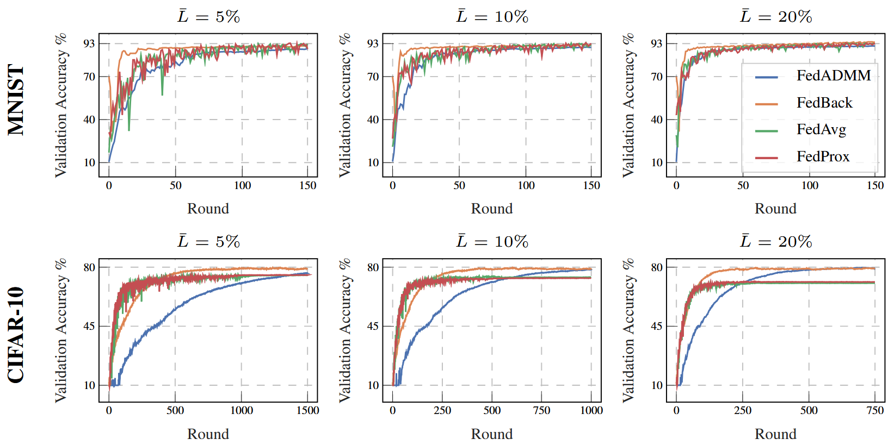
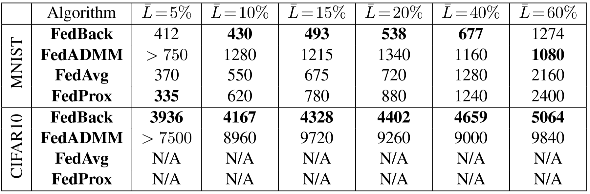

# Controlling Pariticipation in Federated Learning with Feedback
**FedBack** brings control theory to federated learning: we cast client participation as a discrete-time dynamical system and control it with an integral feedback law layered on top of ADMM. This deterministic, event-triggered scheme reduces communication and computation by up to 50 % on MNIST and CIFAR-10 while ensuring global-convergence guarantees and eliminating client-drift.

This work was carried out with [Güner Dilsad Er](https://is.mpg.de/person/gder) and [Michael Muehlebach](https://sites.google.com/view/mmuehlebach/) as part of my MEng dissertation at the [Max-Planck Institute for Intelligent Systems](https://is.mpg.de/lds/). The paper has been accepted to L4DC 2025 and can be viewed on [arxiv](https://arxiv.org/abs/2411.19242).

## Results
FedBack is capable of achieving equivalent validation accuracies as centralised training routines and therefore avoids client drift (Theorem 5 in [paper](https://arxiv.org/abs/2411.19242)). Additionally, FedBack converges in significantly fewer communication rounds than FedAVG, FedProx, and FedADMM. See the [paper](https://arxiv.org/abs/2411.19242) for a detailed discussion of results.

### Training curves for different participation rates.


### Total number of client participation events required to reach target accuracy.


## Running Experiments

To get started, you can set up your workspace by initialising a new conda environment with Python>=3.11 and running:
```
pip install -e .
```

All experiments are run through ```main.py``` in the experiments directory. For example, running FedBack using CIFAR-10 data with a communication rate of 10% can be done by:

```
python main.py --back --cifar --rate 0.1
```

If you would like to experiment with a benchmark, run one of the following,

```
python main.py --avg --cifar --rate 0.1
python main.py --prox --cifar --rate 0.1
python main.py --admm --cifar --rate 0.1
```

Running ```main.py``` will create multiple new directories in ```experiments/``` such as ```figure_data/``` and ```images/```. These directories are used storing and visualising data collected during experiments. This data can be used to reproduce the training curves and results in our paper by running:

```
python plotting.py
```


Note: Run the MNIST experiments by simply replacing ```--cifar``` with ```--mnist```.

## Citing

If you found you used any code or found some ideas in our [paper](https://arxiv.org/abs/2411.19242) useful, please consider citing our paper:
```
@article{cummins2024controlling,
  title={Controlling Participation in Federated Learning with Feedback},
  author={Cummins, Michael and Er, Guner Dilsad and Muehlebach, Michael},
  journal={arXiv preprint arXiv:2411.19242},
  year={2024}
}
```


